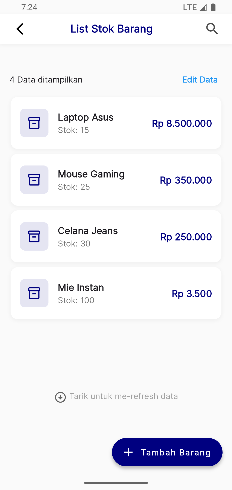
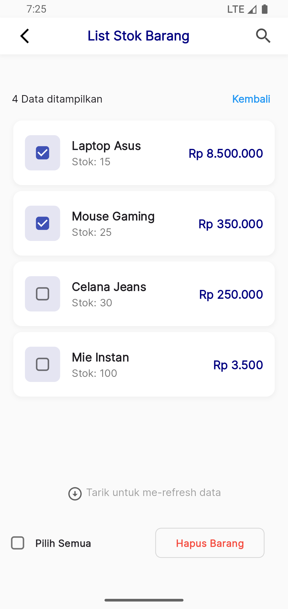
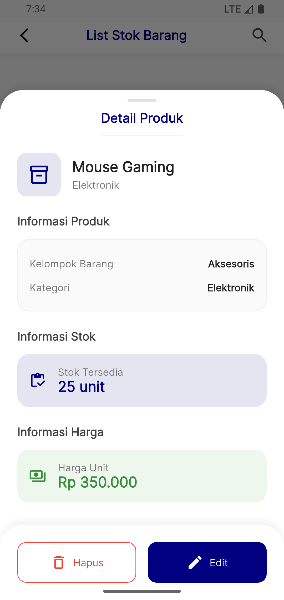
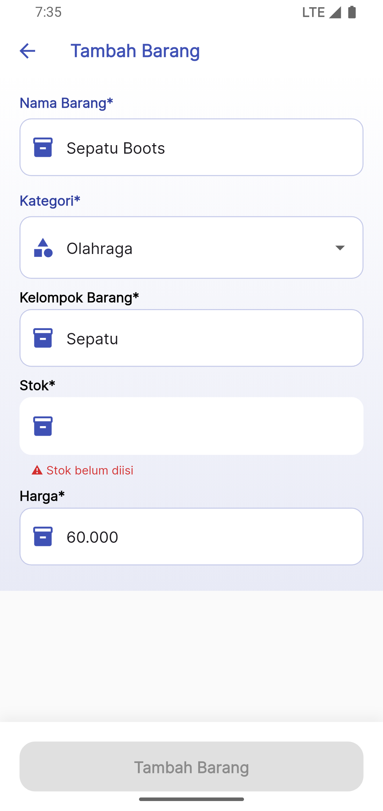
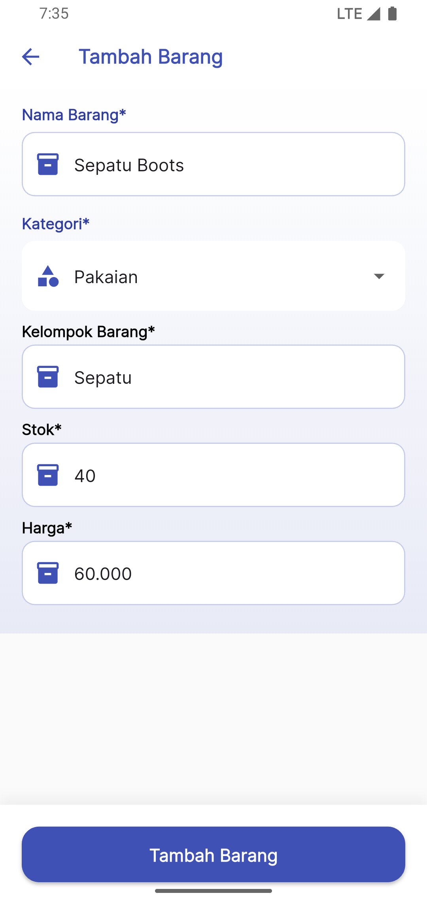
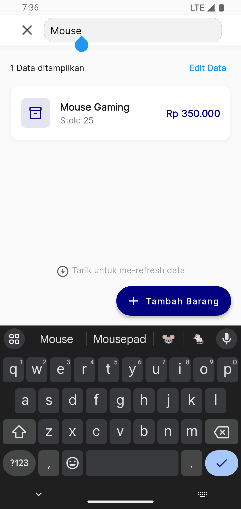

# Management App - Flutter

Aplikasi manajemen produk sederhana menggunakan Flutter dengan state management GetX dan database lokal SQLite.

## Fitur Aplikasi

### 1. Database Lokal SQL

- Tabel Barang

  - id (Primary Key, Auto Increment)
  - nama_barang (Text)
  - kategori_id (Integer)
  - stok (Integer)
  - kelompok_barang (Text)
  - harga (Integer)

- Tabel Kategori
  - id (Primary Key, Auto Increment)
  - nama_kategori (Text)

### 2. Manajemen Produk

- Menampilkan daftar barang dengan informasi:
  - Nama barang
  - Stok
  - Harga (format Rupiah)
- Detail barang menggunakan bottom sheet
- Tambah barang baru dengan validasi input
- Edit data barang
- Hapus barang (single & bulk delete)
- Pencarian barang berdasarkan nama, kategori, dan kelompok

### 3. Fitur Tambahan

- Format currency Rupiah
- Validasi form input
- Loading state
- Error handling
- Pull to refresh
- Responsive layout

## Teknologi yang Digunakan

- Flutter
- GetX (State Management)
- SQLite (Database Lokal)
- Google Fonts
- Animation Search Bar

## Struktur Project

lib/
├── app/
│ ├── core/
│ │ ├── bindings/
│ │ ├── helpers/
│ │ └── widgets/
│ ├── data/
│ │ ├── extensions/
│ │ └── models/
│ ├── modules/
│ │ ├── add_barang/
│ │ └── list_barang/
│ └── routes/
└── main.dart

## Cara Menjalankan Aplikasi

1. Pastikan Flutter SDK sudah terinstall
2. Clone repository ini
3. Jalankan perintah untuk menginstall dependencies:
4. Jalankan aplikasi:

## ScreenShot

| List Barang                    | Bulk Delete                    |
| ------------------------------ | ------------------------------ |
|  |  |

| Detail Product                 | Tambah Product (invalid)       |
| ------------------------------ | ------------------------------ |
|  |  |

| Tambah Product (filled)        | Search                         |
| ------------------------------ | ------------------------------ |
|  |  |
